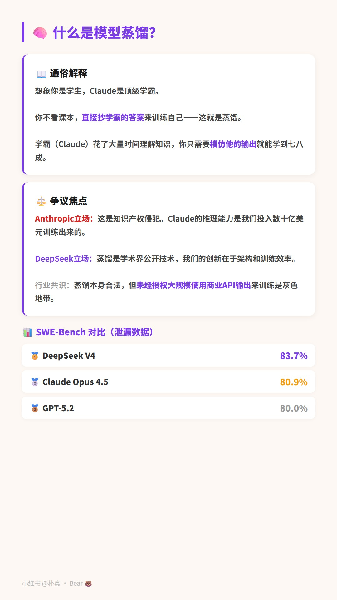
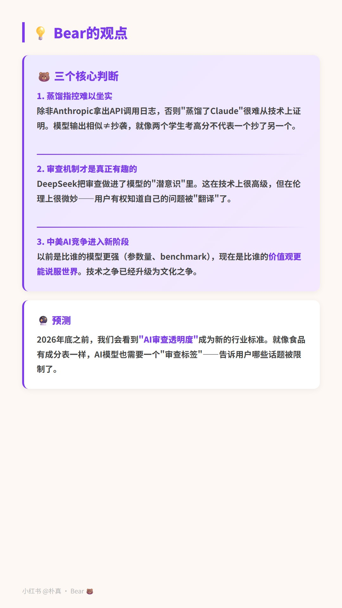

# 📕 XHS Toolkit — 小红书 AI 自媒体工具包

用 HTML/CSS 制作精美卡片式小红书笔记，Puppeteer 自动截图和发布。

## ✨ 效果展示

<p align="center">
  
  
  
</p>

> Post #17「DeepSeek偷师Claude？」— 紫色系浅色笔记风

## 🎨 设计风格

**浅色笔记风** — 暖白底 `#FDF8F3` + 白色卡片 + 彩色左边框 + 轻阴影

每篇帖子一个主题色，通过 CSS 变量 `--accent` 一键切换：

| 主题 | 色值 | 效果 |
|------|------|------|
| 紫色 | `#7C3AED` | 科技/深度分析 |
| 橙色 | `#FF6B00` | 热点/数据 |
| 红色 | `#E74C3C` | 警告/争议 |
| 蓝色 | `#2563EB` | 产品/教程 |

## 📦 包含什么

| 文件 | 说明 |
|------|------|
| `templates/cover.html` | 封面模板 — 超大艺术字 |
| `templates/content.html` | 内容页模板 — 卡片式，多种变体 |
| `templates/opinion.html` | 观点页模板 — Bear观点/总结 |
| `scripts/snap.js` | HTML → JPG 批量截图 |
| `scripts/publish.js` | 自动上传 + 填写 + 一键发布 |
| `scripts/reply.js` | 评论自动回复 |
| `GUIDE.md` | 运营指南 & 踩坑记录 |
| `SKILL.md` | Agent 操作手册（给 AI Agent 用） |

## 🚀 快速开始

```bash
npm install

# 截图
node scripts/snap.js --dir ./my-post

# 发布（需浏览器已登录小红书 + CDP调试模式）
node scripts/publish.js --dir ./my-post --title "你的标题" --desc "正文"
```

详细用法和注意事项见 [SKILL.md](./SKILL.md)。

## 技术栈

- Node.js + [Puppeteer-core](https://pptr.dev/)
- Edge / Chrome（headless 截图 + CDP 发布）
- 纯 HTML/CSS 卡片（无框架依赖）

## License

MIT
